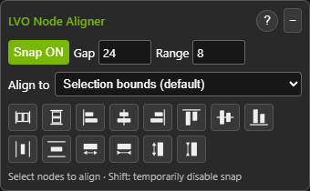

# LVO Node Aligner

A standalone ComfyUI layout toolbar by **LVOcode**, built on work from
**Tenney95** and **Pixaroma**. Align nodes, set exact gaps, snap while moving
or resizing, and arrange collapsed or pinned nodes with predictable spacing.

This is an **editor toolbar**, not an executable node. It adds no generation
steps and does not need to be placed in a workflow.

## Installation

1. Download this repository as a ZIP and extract it.
2. Place its folder in `ComfyUI/custom_nodes/ComfyUI-LVO-Node-Aligner`.
   `__init__.py` and `web/` must be directly inside that folder.
3. Restart ComfyUI, then refresh the browser with **Ctrl+F5**.
4. Find the **LVO** button in the upper-right toolbar, near the settings controls.

No additional Python packages are required. Neither ComfyUI-Pixaroma nor
ComfyUI-NodeAligner needs to be installed.

## Quick start

1. Select at least two nodes; the panel opens automatically.
2. Set **Gap** to the space you want between visible node edges.
3. Use the alignment buttons, **Row: exact Gap**, or **Column: exact Gap**.
4. Enable **Snap** to apply the same gap while dragging or resizing nodes.
5. Hold **Shift** to temporarily bypass snapping.

Select a node in **Align to** to keep it stationary while aligning the others
to it. Reference selection also applies to Row and Column. The reference must
remain selected. Equal-size and Fill operations do not use the reference.

The panel normally hides when fewer than two nodes are selected. The upper-right
**LVO** button can also open it manually. Drag the panel by its title to move it;
its position is remembered in this browser. **−** collapses the controls, and
**?** opens detailed English help for every action.

## LVOcode additions and changes

Compared with the supplied upstream starting points, this version adds or
reworks the following behavior:

- Configurable **exact edge-to-edge gaps** for rows and columns.
- **Move snapping** and **resize snapping**, with a separate screen-space range.
- Snapping of a selected group while preserving its internal arrangement.
- Correct visible bounds for **collapsed nodes**, rather than their hidden body sizes.
- Alignment, row/column arrangement, sizing and Fill actions for **pinned nodes**,
  preserving their pin state.
- **Fill horizontal space** and **Fill vertical space**: equal node sizes inside
  the selection's outer bounds while retaining the requested gap.
- An **Align to** reference selector, including reference-aware rows and columns.
- Manual toolbar activation combined with automatic selection-based visibility.
- Remembered panel position and Gap/Range/Snap settings, with viewport clamping.
- Undo transactions for toolbar operations, English help, and LVOcode styling.

These are modifications and integrations by LVOcode, not a claim that all
underlying alignment ideas originated in this project.

## Controls

| Control | Behavior |
| --- | --- |
| Gap | Spacing in workflow coordinates; default 20. |
| Range | Snap capture distance in screen pixels; default 8. |
| Snap | Enables move/resize snapping; off by default. |
| Align to | Selection bounds or a stationary selected reference node. |
| Six edge/center buttons | Align left, horizontal centers, right, top, vertical centers or bottom. |
| Row / Column | Preserve spatial order and apply the exact Gap. |
| Equal width / height | Match the largest or smallest selected expanded node. |
| Fill horizontal / vertical space | Give expanded nodes equal dimensions within the existing outer span. |

With no reference selected, Row anchors the leftmost node and Column anchors
the topmost node. With a reference, nodes are arranged before and after it.
Collapsed nodes participate in alignment and spacing. Size-changing actions
skip collapsed nodes; Fill requires all selected nodes to be expanded.

Toolbar actions can move pinned nodes intentionally. Interactive dragging and
resize snapping do not drag pinned nodes; pinned nodes can still be snap targets.
Node minimum sizes are respected. Fill reports insufficient space instead of
forcing nodes below those limits.

## Compatibility and limitations

- Includes handling for Classic canvas and Nodes 2.0 pointer behavior.
- Custom nodes and future ComfyUI frontend versions may impose additional
  sizing or toolbar limitations. No universal frontend-version guarantee is made.
- Snap does not create permanent links between nodes or resize neighboring nodes.
- Group-frame snapping is not supported.
- Disable competing snapping features in other extensions while using this one.
- Panel settings are stored in browser local storage; node positions are stored
  normally in the workflow. Use ComfyUI undo for toolbar edits.

The standalone copy passed geometry and Chromium browser regression checks for
alignment, pinned/collapsed nodes, exact spacing, reference handling, Fill,
move/resize snapping, selection behavior and saved panel position. Browser checks
use mocked ComfyUI services; they are not full integration tests on every release.

## Thanks and attribution

**Thank you, Tenney95**, for [ComfyUI-NodeAligner](https://github.com/Tenney95/ComfyUI-NodeAligner).
Its toolbar functionality and SVG icons provided a foundation for this extension.

**Thank you, Pixaroma**, for [ComfyUI-Pixaroma](https://github.com/pixaroma/ComfyUI-Pixaroma).
Its Align implementation informed the pointer-event approach and collapsed-node
geometry; this package also retains a small renderer-detection helper derived
from its shared helpers.

Their work made this adaptation possible. This is an independent LVOcode project;
it is not an official release or endorsement by either upstream author.

## License

The combined extension is distributed under **GNU GPL version 3 (GPL-3.0-only)**.
See [LICENSE](LICENSE). Pixaroma-derived portions retain their original
[MIT notice](licenses/MIT-Pixaroma.txt).

See [THIRD_PARTY_NOTICES.md](THIRD_PARTY_NOTICES.md) for source attribution and
[LICENSING.md](LICENSING.md) for distribution notes. Keep these files with the source.
